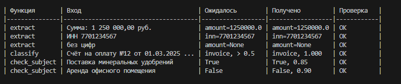
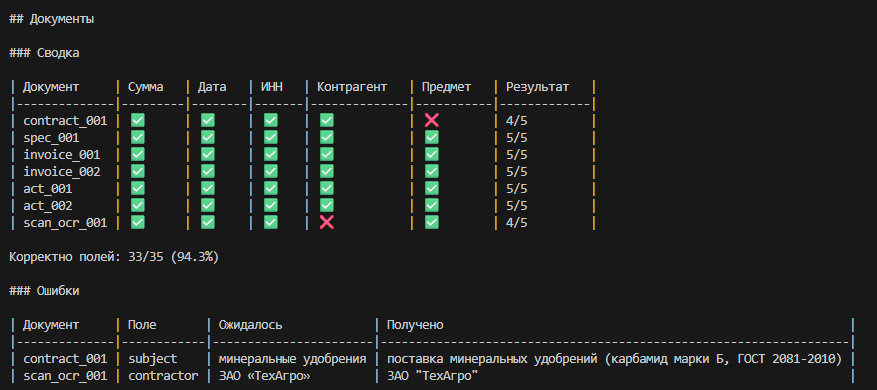
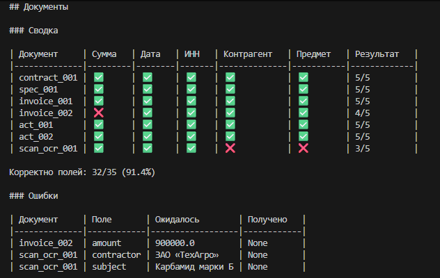
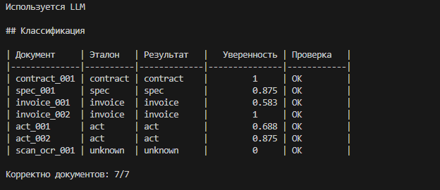
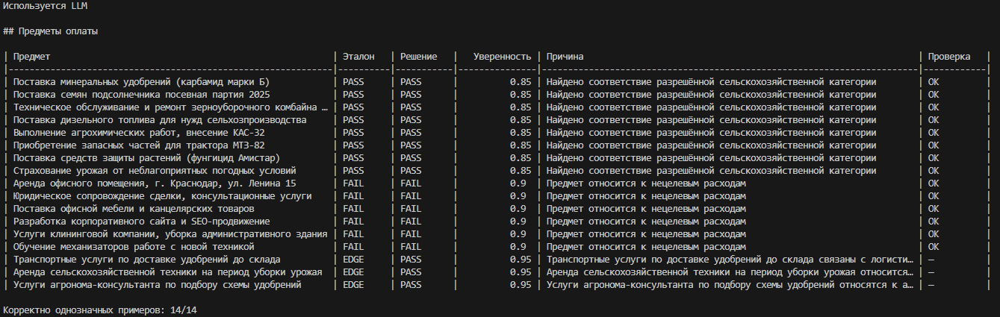
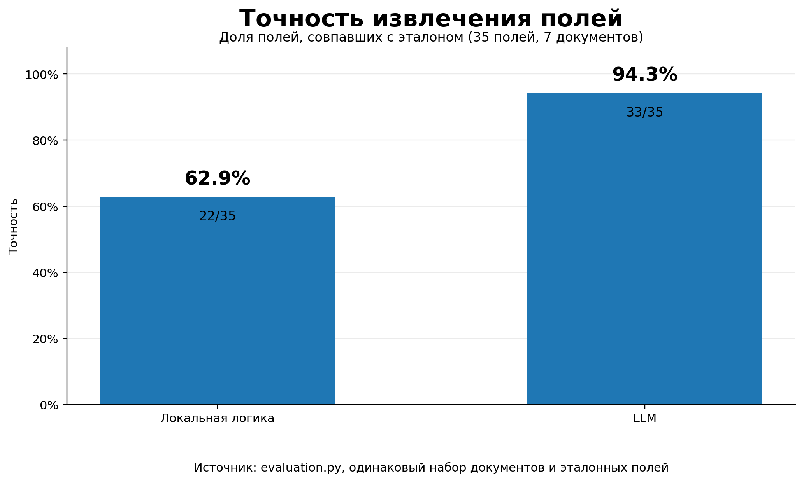

## Мотивация участия в проекте
### Почему тебе интересен этот проект? 
Мне интересна DS-сфера и я стремлюсь использовать возможности для профессионального развития в ней, этот проект мне кажется отличной возможностью поработать над прикладным продуктом который решает реальную бизнес задачу и использовать свои знания в "боевых" условиях

### Как ты видишь свою роль в команде, которая создаёт продукт?  
Вижу себя в роли DS-инженера, отвечающим за исследование данных, разработку и валидацию работы модели, а также выбор метрик и анализ ошибок. И помимо моих прямых обязанностей вижу себя командным игроком нацеленным на результат.

### Сколько времени в неделю ты готов(а) уделять проекту и в течение какого периода?
Готов уделять проекту 20-25 часов в неделю на протяжении ближайших трёх месяцев.

## 1. Как запустить проект

```bash
python -m pip install -e .
python -m pytest
python -m evaluation --report all
```

Первые две команды устанавливают зависимости и запускают unit-тесты. Последняя
запускает полный пайплайн на примерах из задания и документах из папки
`documents/`.

Для работы без LLM дополнительных настроек не требуется. Для опционального
режима с Hugging Face нужно скопировать `.env.example` в `.env` и указать токен:

```env
HF_TOKEN=hf_...
HF_MODEL_ID=Qwen/Qwen3-4B-Instruct-2507
HF_PROVIDER=auto
```
## 2. Какие технологии использованы и почему

- **Python** — основная логика, регулярные выражения, нормализация и CLI.
- **Hugging Face Inference API** — для использованя LLM для обработки документа.
- **python-dotenv** — загрузка настроек из локального `.env`.
- **pytest** — воспроизводимые тесты без реальных сетевых запросов.
- **tabulate** — вывод отчётов в виде читаемых Markdown-таблиц.

## 3. Архитектура решения

```text
documents/              тестовые документы и subjects_test.txt
assets/                 скриншоты отчётов и график качества
src/
├── extraction.py       извлечение и нормализация полей
├── classification.py   классификация документов
├── subject_check.py    проверка предмета оплаты
├── llm_client.py       клиент Hugging Face и обработка ошибок
└── evaluation.py       запуск пайплайна и формирование отчётов
tests/                  unit-тесты с mock-ответами LLM
```

Общий пайплайн:

```text
входной текст
    ├── extract()       → amount, date, inn, contractor, subject
    ├── classify()      → contract / spec / invoice / act / unknown
    └── check_subject() → bool, confidence, reason
                              │
                              └── evaluation.py → итоговый отчёт
```

### `extract(text)`

При наличии токена функция запрашивает у LLM JSON с пятью полями, после чего
локально нормализует сумму, дату и ИНН. Если токена нет, API недоступен или
ответ нельзя разобрать, используется локальное извлечение.

Локальная ветка поддерживает:

- типовые подписи итоговой суммы;
- несколько форматов денежных значений;
- числовые и текстовые даты;
- ИНН из 10 или 12 цифр;
- частые OCR-подмены `O/О → 0` и `I/l → 1`;
- предмет из подписанного поля, первой строки таблицы или типовой формулировки
  договора.

### `classify(text)`

Классификация полностью локальная. Каждый класс получает баллы за сильные и
слабые текстовые признаки. Учитываются типы `contract`, `spec`, `invoice`,
`act`. Если признаков нет или разрыв между двумя лучшими классами меньше
`MIN_MARGIN = 1.0`, возвращается `unknown`.

### `check_subject(subject)`

Сначала применяются локальные списки разрешённых и запрещённых формулировок.
Очевидные PASS/FAIL возвращаются сразу. LLM вызывается только для неоднозначных
случаев, связанных, например, с доставкой, арендой или консультационными
услугами. При отсутствии токена или другой ошибкой связанной с LLM используется локальная логика.

## 4. Компромиссы решения
- `confidence` является эвристикой
- Локальные правила покрывают типовые форматы и не пытаются распознавать любой
  возможный финансовый документ (не "переобучаются" на существующих документах).
- При отсутствии надёжного значения возвращается `None`
- OCR-коррекция ограничена несколькими частыми подменами символов и не заменяет
  полноценную обработку сканов.
- Суммы, полностью записанные словами, локально не разбираются.
- Классификатор основан на понятных ключевых признаках, а не на отдельной
  обученной модели.
- `MIN_MARGIN = 1.0` выбран как компромисс: меньший порог снижает число
  `unknown`, но повышает риск ошибочного класса; больший делает решение
  осторожнее.
- Качество extraction считается как доля совпавших полей. Все пять полей имеют
  одинаковый вес, а текстовые значения сравниваются после нормализации.


## 5. Как проверить работу сервиса

Unit-тесты запускаются командой:

```bash
python -m pytest
```

Они не обращаются к внешнему API: LLM-ответы и ошибки провайдера подменяются
mock-объектами. Проверяются обязательные примеры из задания, нормализация,
локальное извлечение, OCR-подмены, классификация, subject check, обработка
ошибок Hugging Face и формат отчётов.

Полный отчёт запускается командой:

```bash
python -m evaluation --report all
```

Он содержит четыре раздела:

1. примеры из ТЗ;
2. извлечение полей из семи документов;
3. классификацию документов;
4. проверку PASS/FAIL/EDGE из `subjects_test.txt`.

Последний сохранённый прогон показал:

- обязательные примеры: `6/6`;
- extraction с LLM: `33/35` полей;
- extraction без LLM: `32/35` полей;
- классификация: `7/7` документов;
- однозначные предметы оплаты: `14/14`;
- unit-тесты: `62 passed`.

Для отдельной проверки можно использовать значения `requirements`,
`documents`, `classification` и `subjects` параметра `--report`.

## 6. Примеры вызовов функции и скриншоты

```python
from extraction import extract
from classification import classify
from subject_check import check_subject

fields = extract(
    "Счёт №12 от 01.03.2025. Итого: 1 250 000 руб."
)

doc_type, confidence = classify(
    "Счёт на оплату №12"
)

matches, confidence, reason = check_subject(
    "Поставка карбамида"
)
```

`extract()` всегда возвращает словарь одинаковой формы:

```python
{
    "amount": float | None,
    "date": str | None,
    "inn": str | None,
    "contractor": str | None,
    "subject": str | None,
}
```

Пример CLI:

```bash
python -m evaluation --report all
python -m evaluation --report documents
python -m evaluation --report classification
python -m evaluation --report subjects
```

### Примеры из ТЗ



### Извлечение полей с LLM



### Извлечение полей без LLM



### Классификация документов



### Проверка предметов оплаты



### Сравнение точности извлечения



